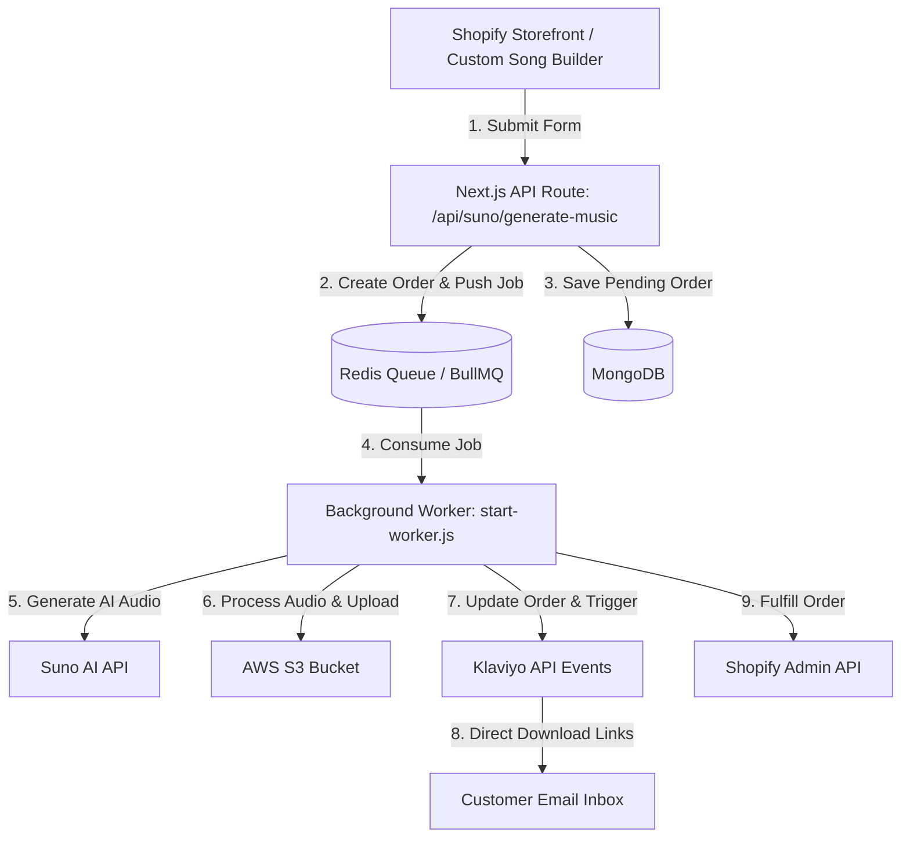

# 🎵 Music Dashboard & AI Custom Song Builder

**Music Dashboard** is a high-performance, full-stack Next.js platform designed for **AI Music Generation**, **Shopify E-Commerce Integration**, **BullMQ Background Task Processing**, and **Automated Order Fulfillment & Klaviyo Email Delivery**.

---

## 📌 Architecture Overview



---

## 🛠️ Technology Stack

| Component | Technology Used | Description |
| :--- | :--- | :--- |
| **Framework** | Next.js 16 (App Router) | Full-stack SSR, Server Actions, & API Routes |
| **UI & Styling** | React 19 + Tailwind CSS v4 | Responsive Admin Dashboard & Custom Widget |
| **Database** | MongoDB + Mongoose ODM | Customer, Order, Song, and System Settings data |
| **Queue & Worker** | Redis + BullMQ (`ioredis`) | Asynchronous background music processing |
| **Cloud Storage** | AWS S3 (`@aws-sdk/client-s3`) | MP3 audio files and cover art storage |
| **Audio Engine** | FFmpeg (`fluent-ffmpeg`) | Audio clipping, watermark mixing, and duration |
| **AI Generation** | Suno AI API | Custom lyrics and music generation |
| **Email Marketing**| Klaviyo API | Automated email triggers (`Music_Ready_To_Select`, `Music_Delivered`) |
| **E-Commerce** | Shopify Admin API & Webhooks | Order synchronization and automatic fulfillment |

---

## 🚀 Getting Started

### 1. Prerequisites

Make sure you have the following installed on your development system:
* **Node.js**: `v20.x` or later
* **npm**: `v10.x` or later
* **Redis Server**: Local Redis instance (`redis://127.0.0.1:6379`) or Redis Cloud URI
* **FFmpeg**: Installed and added to system `PATH` (for audio processing)

---

### 2. Environment Setup

Create a `.env.local` file in the root directory and configure the environment variables:

```env
# ── Server & Database ──
NEXT_PUBLIC_APP_URL="http://localhost:3000"
MONGODB_URI="mongodb+srv://<username>:<password>@cluster.mongodb.net/MusicDashboard"
JWT_SECRET="your_super_secret_jwt_key"

# ── Redis & Queue (Required for BullMQ Background Worker) ──
REDIS_URL="redis://127.0.0.1:6379"

# ── AWS S3 Storage (Required for Song Uploads) ──
AWS_REGION="us-east-1"
AWS_ACCESS_KEY_ID="your_aws_access_key"
AWS_SECRET_ACCESS_KEY="your_aws_secret_key"
AWS_S3_BUCKET_NAME="your_s3_bucket_name"

# ── Suno AI API ──
SUNO_API_BASE="https://api.suno.ai"
SUNO_API_KEY="your_suno_api_key"

# ── Security & Cloudflare Turnstile ──
TURNSTILE_SECRET_KEY="your_cloudflare_turnstile_secret"
```

---

### 3. Installation & Running Locally

1. **Clone the repository and install dependencies**:
   ```bash
   git clone https://github.com/MdSHiFaTRaHMaN/Music-Deshboard.git
   cd Music-Deshboard
   npm install
   ```

2. **Start the Web Dashboard**:
   ```bash
   npm run dev
   ```
   *Dashboard will be available at [http://localhost:3000](http://localhost:3000)*

3. **Start the Background Worker Process** *(in a separate terminal)*:
   ```bash
   npm run worker
   ```
   *This process listens to the Redis queue and handles music generation, AWS S3 uploads, Klaviyo email triggers, and Shopify fulfillment.*

---

## ⚡ Core Feature Flows & Developer Guide

### 1. Custom Song Builder (Shopify Storefront Widget)
Located in root:
* `custom-song-builder.liquid`: Shopify Liquid section template.
* `custom-song-builder.css`: High-specificity, isolated CSS (prevents theme styling conflicts).
* `custom-song-builder.js`: Vanilla JS controller managing 10-step wizard flow, AI lyrics generation, audio previews, and package selection.

### 2. Direct MP3 Download API (`/api/download`)
* **Endpoint**: `GET /api/download?url=<ENCODED_URL_OR_S3_KEY>&filename=<FILENAME>`
* **Features**:
  * Automatically detects if `url` is an S3 Key (e.g. `music/orderId/file.mp3`) and generates a signed AWS S3 Presigned URL on the fly.
  * Streams audio with `Content-Disposition: attachment; filename="SongTitle.mp3"` header.
  * Ensures instant direct browser download when clicked in delivery emails or admin pages.

### 3. Klaviyo Automated Email Flows
* **`sendKlaviyoMusicReady` (`Music_Ready_To_Select`)**: Triggered when a demo song is ready before checkout (Abandoned Cart Flow). Contains a magic resume link (`?resumeOrder=id`).
* **`sendKlaviyoMusicDelivery` (`Music_Delivered`)**: Triggered when a paid order's song is fully generated. Contains direct MP3 download links via `/api/download`.

### 4. Shopify Order Synchronization & Fulfillment
* **Webhook Endpoint**: `POST /api/shopify/webhooks/orders-create`
  * Captures new Shopify orders and matches line item `Music ID` properties to MongoDB orders.
* **Auto-Fulfillment**:
  * Uses `src/lib/shopifyFulfill.js` to mark Shopify order line items as fulfilled automatically once music processing completes.

---

## 🧪 Testing & Verification

Run production build check to ensure clean compilation:
```bash
npm run build
```

Run ESLint check:
```bash
npm run lint
```

---

## 📁 Key File Structure

```
Music-Deshboard/
├── custom-song-builder.liquid  # Shopify Liquid Widget
├── custom-song-builder.css     # Scoped Widget Styles
├── custom-song-builder.js      # Vanilla JS Widget Controller
├── start-worker.js             # Entry point for BullMQ Background Worker
├── src/
│   ├── app/                    # Next.js App Router (Pages & API Routes)
│   │   ├── (admin)/            # Admin Dashboard Pages (Orders, Customers, Musics)
│   │   └── api/
│   │       ├── download/       # Direct Attachment Audio Download API
│   │       ├── suno/           # Suno AI Generation & Status API Routes
│   │       └── shopify/        # Shopify Webhooks & Fulfillment APIs
│   ├── components/             # Reusable UI & Table Components
│   ├── lib/                    # Core Libraries (S3, Klaviyo, Mongoose, Redis, Security)
│   ├── models/                 # MongoDB Schemas (Order, Customer, User, Settings)
│   └── workers/
│       └── musicWorker.js      # BullMQ Worker logic (Audio processing, S3, Klaviyo)
└── package.json
```

---

## 📜 License & Support

This project is proprietary and built specifically for custom song builder e-commerce operations.
