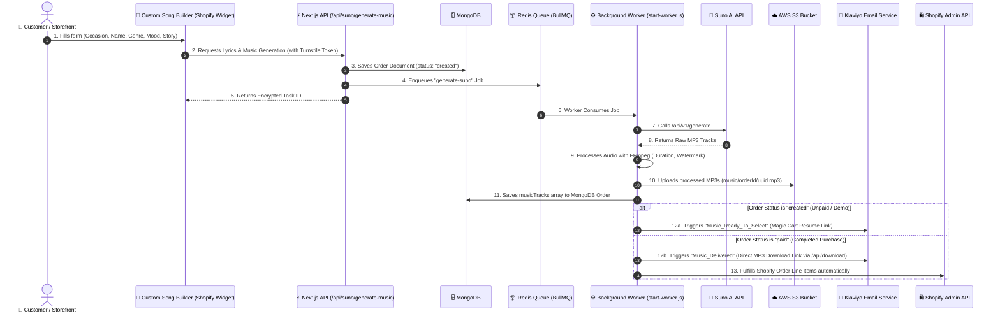

# 🎵 Music Dashboard & AI Custom Song Builder

**Music Dashboard** is an end-to-end, enterprise-grade Next.js application designed for **AI Music Generation**, **Shopify E-Commerce Order Integration**, **Redis BullMQ Background Queue Processing**, **AWS S3 Audio Storage**, **FFmpeg Media Processing**, and **Automated Klaviyo Email Delivery**.

---

## 🏗️ System Architecture & Workflow



---

## 🧠 System Components Deep-Dive

### 1. Storefront Widget (`custom-song-builder.*`)
* **`custom-song-builder.liquid`**: High-performance Shopify Section template.
* **`custom-song-builder.css`**: Isolated, zero-leak CSS ensuring pixel-perfect layout matching modern Shopify themes (Minimog, Publisher, etc.).
* **`custom-song-builder.js`**: Vanilla JavaScript controller driving a 10-step wizard:
  1. Occasion Selection
  2. Recipient Name & Pronunciation
  3. Method Selection (Write for us / Own lyrics) & AI Lyrics Generator
  4. Lyrics Review & Editing
  5. Customer Email & Demo Lock Box (Cloudflare Turnstile Protected)
  6. Music Style Selection (Genre, Voice, Mood)
  7. Live AI Song Generation (with smooth exponential progress simulation & shimmer animation)
  8. Interactive Track Player & Selection
  9. Centered 3-Column Package Grid
  10. Order Confirmation, Rush Order Checkbox, Terms Agreement & Checkout.

---

### 2. Next.js API Subsystem (`src/app/api`)

| API Route | HTTP Method | Purpose |
| :--- | :--- | :--- |
| **`/api/suno/generate-lyrics`** | `POST` | Interacts with Suno GPT API to generate custom AI song lyrics variations. |
| **`/api/suno/generate-music`** | `POST` | Security checks (Turnstile, Rate Limits, Honeypot), creates MongoDB `Order`, enqueues BullMQ task, launches `abandonedCartChecker`. |
| **`/api/suno/status`** | `GET` | Frontend polling endpoint to fetch live Suno task status. |
| **`/api/download`** | `GET` | **Direct Attachment Download API**: Accepts `url` (HTTP URL or raw S3 Key) and `filename`. Auto-generates S3 Presigned URLs for S3 keys and streams audio with `Content-Disposition: attachment; filename="SongTitle.mp3"`. |
| **`/api/shopify/webhooks/orders-create`** | `POST` | Shopify Webhook listener for `orders/create`. Matches line item `Music ID` properties to MongoDB orders and updates status. |
| **`/api/shopify/fulfill/[id]`** | `POST` | Auto-fulfills Shopify order line items using the Shopify Admin REST/GraphQL API. |
| **`/api/customers/block`** | `POST` | Admin security endpoint to block/unblock malicious IPs or emails. |
| **`/api/auth/*`** | `POST / GET` | Admin authentication system using JWT (`jose`), Password Hashing (`bcryptjs`), and 2FA (`speakeasy` + `qrcode`). |

---

### 3. Background Processing & Async Queue

* **Worker Entry Point (`start-worker.js`)**:
  * Runs as an isolated standalone Node.js process using `tsx` (`npm run worker`).
  * Implements **Graceful Shutdown** (`SIGINT`, `SIGTERM`) using `await worker.close()` to ensure in-flight jobs finish cleanly without dropping connections.
* **Worker Core (`src/workers/musicWorker.js`)**:
  * Consumes `generate-suno` queue jobs from Redis.
  * Downloads raw audio streams to temporary system files (`os.tmpdir()`).
  * Uses `fluent-ffmpeg` to parse audio duration and prepare files.
  * Uploads full tracks and previews to AWS S3 (`music/${orderId}/${uuid}.mp3`).
  * Updates MongoDB `Order` document.
  * Triggers Klaviyo events (`Music_Ready_To_Select` for unpaid demos, `Music_Delivered` for paid orders).
* **Abandoned Cart Checker (`src/lib/abandonedCartChecker.js`)**:
  * Periodically verifies MongoDB `musicTracks` for unpaid demo orders.
  * Dispatches `Music_Ready_To_Select` Klaviyo events with magic cart resume links (`?resumeOrder=id`).

---

### 4. Data Models (`src/models`)

* **`Order.js`**: Main document storing customer email, `taskId`, `musicId`, `musicTracks` array (with `audioUrl`, `streamAudioUrl`, `imageUrl`, `duration`), `selectedDemo`, `selectedPackage`, `resumeEmailSent`, `deliveryEmailSent`, `resumeBaseUrl`, `status` (`created`, `pending_payment`, `paid`, `failed`).
* **`Customer.js`**: Customer profiles, security flags, known IP addresses, rate-limiting counters, auto-block status (`isBlocked`, `blockedUntil`, `blockReason`).
* **`Settings.js`**: Dynamic system configuration storing Shopify Admin API Keys, Store URLs, Suno API credentials, Klaviyo API Key, and Auto-Block threshold rules.
* **`User.js`**: Admin dashboard accounts with hashed passwords and 2FA secrets.
* **`Notification.js`**: System alerts and real-time dashboard notifications.

---

## 🛠️ Environment Configuration (`.env.local`)

```env
# ── Core & Server Config ──
NEXT_PUBLIC_APP_URL="http://localhost:3000"
MONGODB_URI="mongodb+srv://<username>:<password>@cluster.mongodb.net/MusicDashboard"
JWT_SECRET="your_super_secret_jwt_key"

# ── Redis Queue (Required for BullMQ Worker) ──
REDIS_URL="redis://127.0.0.1:6379"

# ── AWS S3 Storage Config (Required for Song Storage & Downloads) ──
AWS_REGION="us-east-1"
AWS_ACCESS_KEY_ID="your_aws_access_key"
AWS_SECRET_ACCESS_KEY="your_aws_secret_key"
AWS_S3_BUCKET_NAME="your_s3_bucket_name"

# ── Suno AI API Config ──
SUNO_API_BASE="https://api.suno.ai"
SUNO_API_KEY="your_suno_api_key"

# ── Cloudflare Turnstile Verification ──
TURNSTILE_SECRET_KEY="your_cloudflare_turnstile_secret"
```

---

## 💻 Developer Setup & Commands

### 1. Installation
```bash
git clone https://github.com/MdSHiFaTRaHMaN/Music-Deshboard.git
cd Music-Deshboard
npm install
```

### 2. Running Locally (Development Mode)
Start the web dashboard server:
```bash
npm run dev
```

Start the background worker in a separate terminal:
```bash
npm run worker
```

### 3. Production Build & Linting
```bash
npm run build
npm run lint
```

---

## 📁 Repository Directory Structure

```
Music-Deshboard/
├── custom-song-builder.liquid    # Shopify Theme Section Widget
├── custom-song-builder.css       # Scoped Isolated Widget Styles
├── custom-song-builder.js        # Widget 10-Step Controller Logic
├── start-worker.js               # Standalone Worker Entry Point (Graceful Shutdown)
├── src/
│   ├── app/                      # Next.js App Router
│   │   ├── (admin)/              # Dashboard Pages (Orders, Customers, Musics, Settings)
│   │   └── api/                  # API Subsystems (Download, Suno, Shopify, Auth)
│   ├── components/               # React Components (Tables, Modals, Forms, Buttons)
│   ├── lib/                      # Core Utility Modules:
│   │   ├── s3.js                 # AWS S3 Uploads & Presigned URLs
│   │   ├── klaviyo.js            # Klaviyo Event Dispatchers
│   │   ├── shopifyFulfill.js     # Shopify Fulfillment API
│   │   ├── security.js           # Turnstile & Rate-Limiting
│   │   ├── abandonedCartChecker.js # Demo Order Recovery Poller
│   │   └── mongoose.js           # Database Connection Manager
│   ├── models/                   # Mongoose Schemas (Order, Customer, Settings, User)
│   └── workers/
│       └── musicWorker.js        # BullMQ Worker Engine
└── package.json
```

---

## 📄 License & Maintainer

Developed specifically for custom AI song builder e-commerce platforms. All rights reserved.
